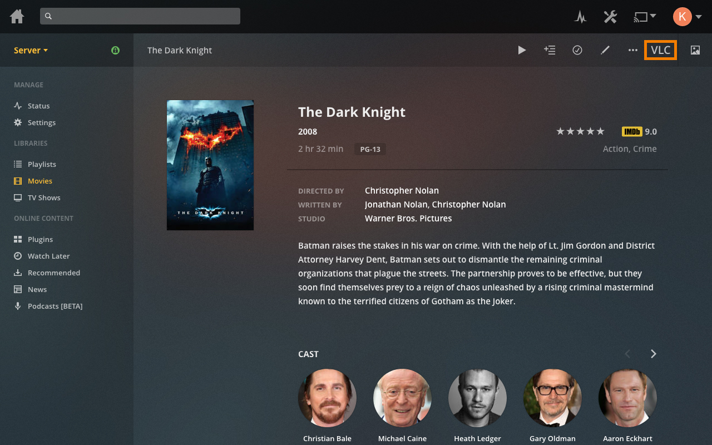

# Plex to VLC
> Play your videos in VLC right from the Plex Web Player interface.

*Only available for macOS. If you need a Windows version, check out [Kayomani/PlexExternalPlayer](https://github.com/Kayomani/PlexExternalPlayer)*

## Limitations

* The companion app only works on macOS and is needed for the Chrome extension to work.
* This only works for files that are available locally on your computer.
* I don't have an Apple Developer account so I can't sign the app. You will be notified of that while installing or during the first launch. If you want to, you can go over the source and build/sign it yourself. Check *Development / Compiling* on how to do that.
* Currently not supporting playback of whole seasons or multile files.

## Installing

### Automatic

1. Download the *.pkg* file from the [release page](https://github.com/soerenkampschroer/plex-to-vlc/releases/latest).
2. Run the installer.
3. Done!

### Manual

1. Download the *.dmg* from the [release page](https://github.com/soerenkampschroer/plex-to-vlc/releases/latest).
2. Double click the *.dmg*: This mounts the disk image and opens it in a Finder window.
3. Drag and drop the contained `plex-to-vlc.app` to `/Applications`
4. Download the Native Messaging configuration file for Chrome [here](chrome-extension/com.soerenkampschroer.plextovlc.json).
    Move it to `~/Library/Application\ Support/Google/Chrome/NativeMessagingHosts/`.
  **Note:** If you didn't move the App to `/Applications` in step 2, you need to update the path in the json file.

## Usage

The Chrome extension adds a button to the Plex Web Player interface. If it's clicked, the extension fetches the file path and sends it to the companion app via Native Messaging.

The app then opens the file in VLC.

## Development / Compiling

If you want to change how the app works or compile it yourself just clone the repository and navigate to plex-to-vlc/host.

* Run `npm install` to install the dependencies.
* To run the app use `npm run start`.
* To compile use `npm run dist`.
  * If you want to use the *.pkg* installer after compiling, make sure to delete the *.app* in `plex-to-vlc/host/dist/mac`. Otherwise the installer will detect it and skip installing the app.

## Help

If you need any help, just open an issue here. Make sure to include:
* macOS version
* Path to VLC
* Path to plex-to-vlc.app
* Contents of the configuration file in `~/Library/Application\ Support/Google/Chrome/NativeMessagingHosts/`.

## License

This project is licensed under the GPLv3 License - see the LICENSE.md file for details.
